# Développement d'un micro service
### 1 - create Customer & BankAccount Entities
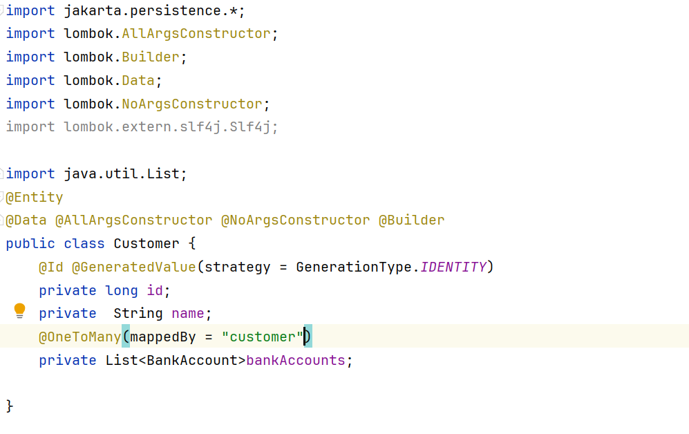
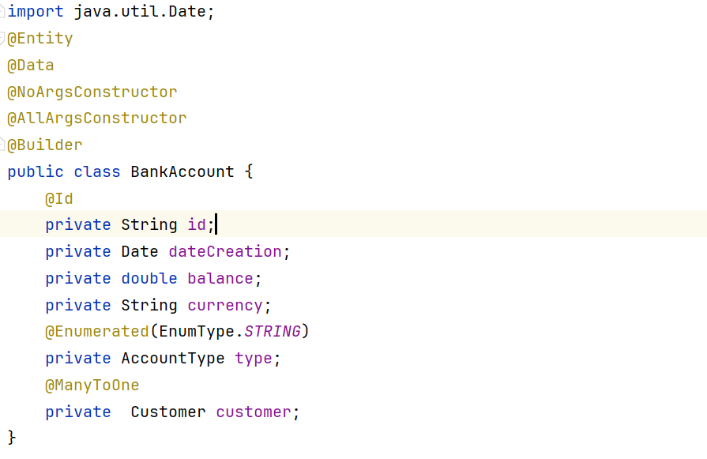

### 2 -create Customer Repository && BankAccount Repository
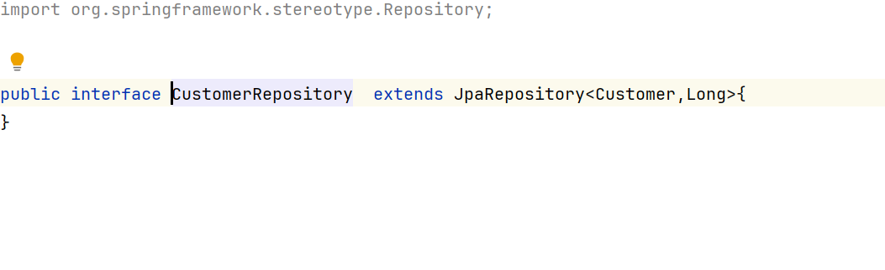

### 3 -create BankAccount DTO && AccountMapper to Map DTO with real Entity
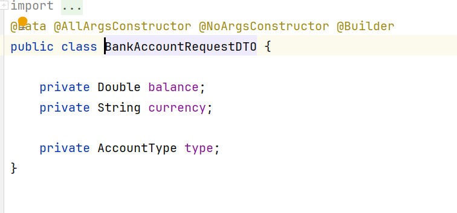
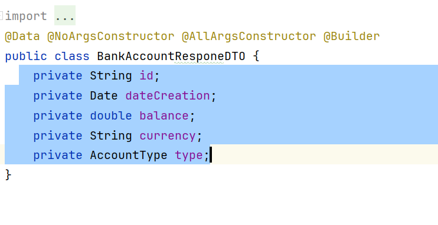

### 4 -create BankAccount Service and his implementation which i added (updated and saved method to update and added BankAccount Object and map them with real entity)
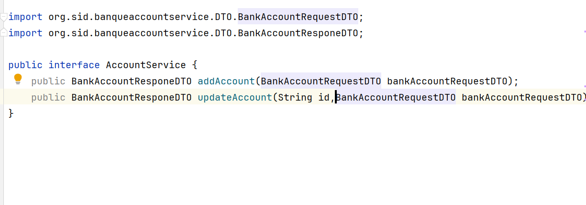
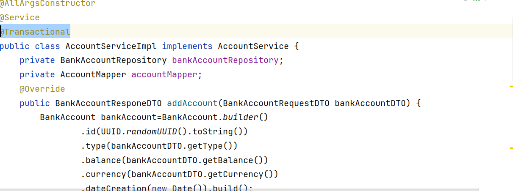

### 5 -create RestApi to make different crud operations
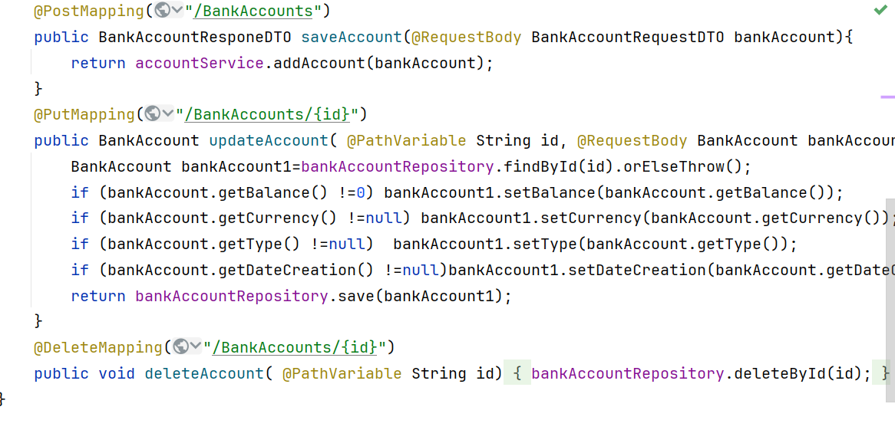

### 6 -test with openapi
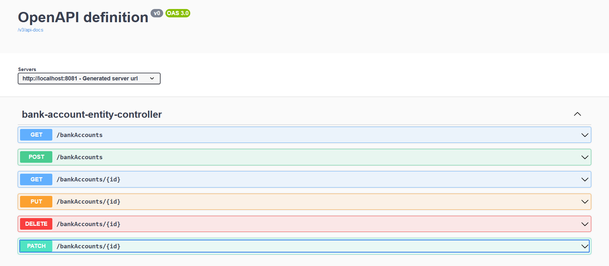

### 7 -test with postman
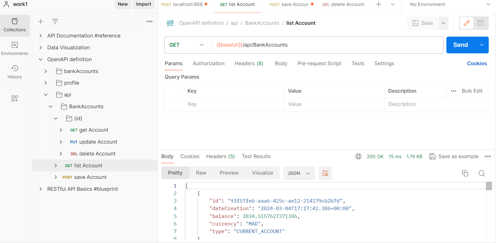

### 8-browser test
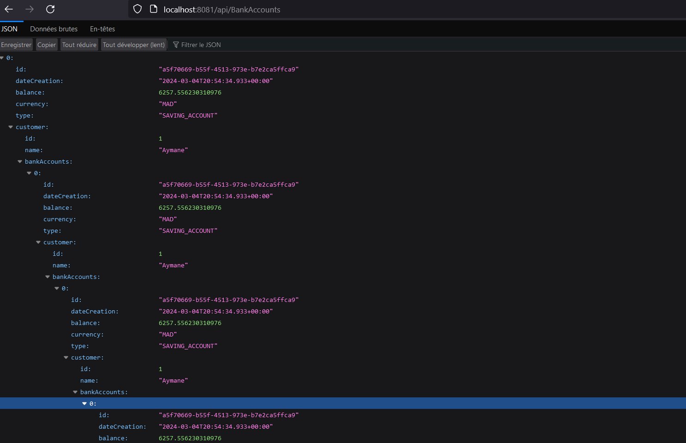

# Partie GraphQl

### 9-Schema GraphQl

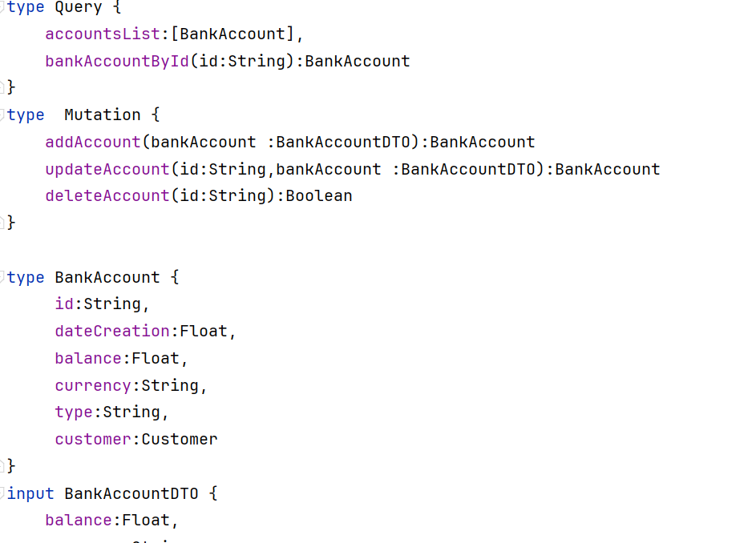

### 10-Controller GraphQl
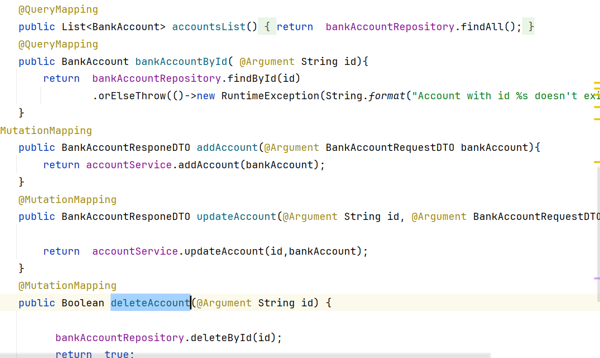

### 11-Test GraphQl
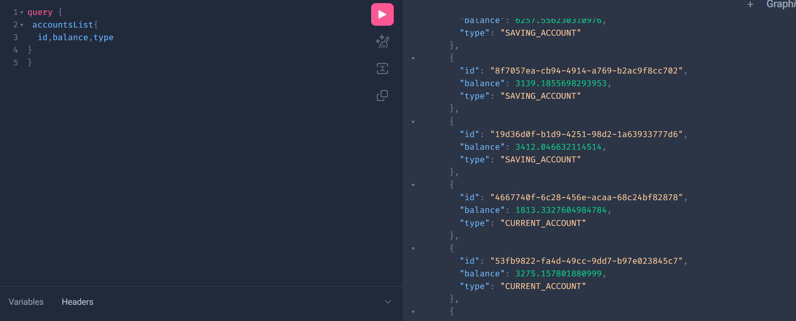
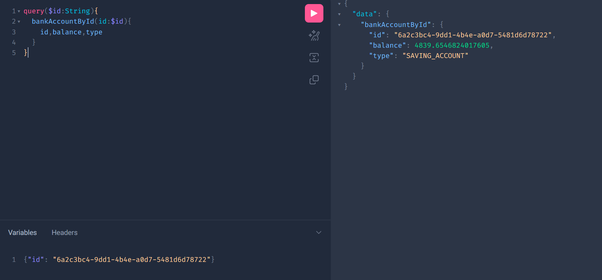
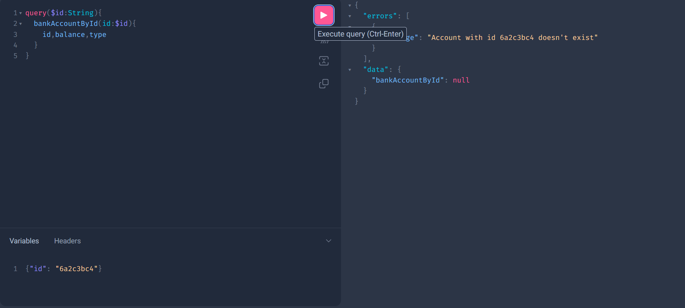
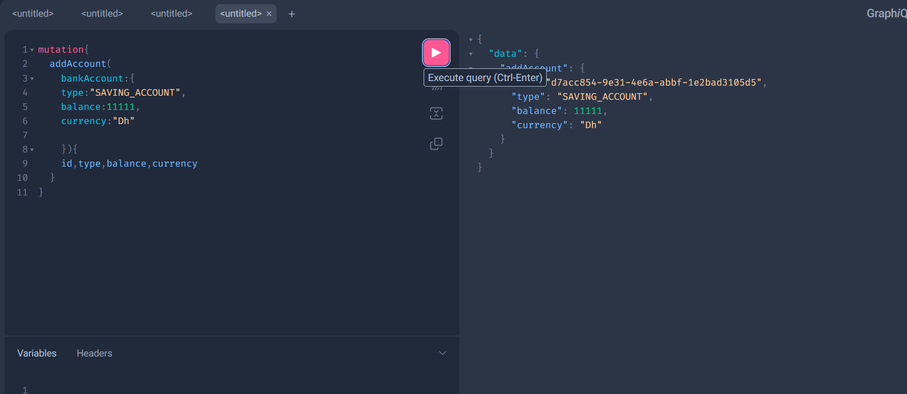

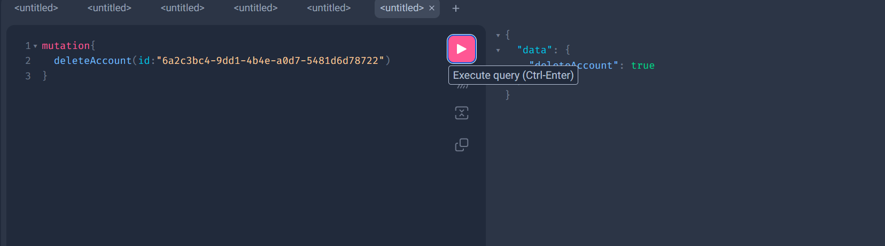

